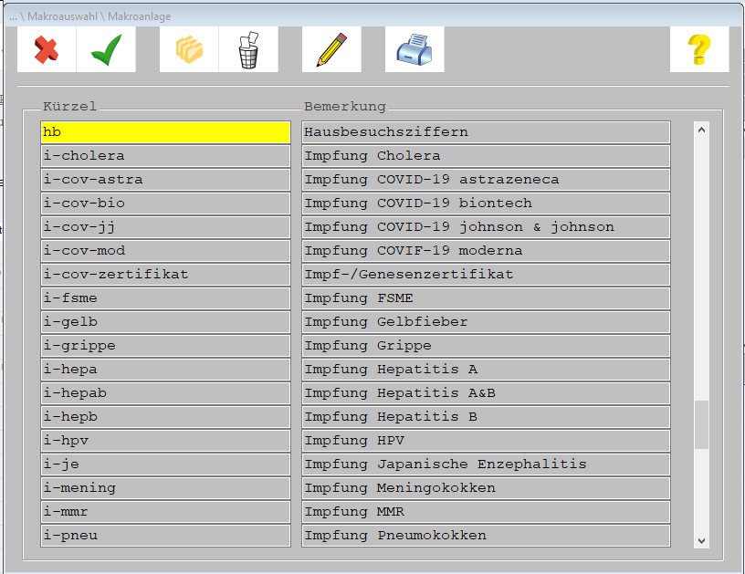
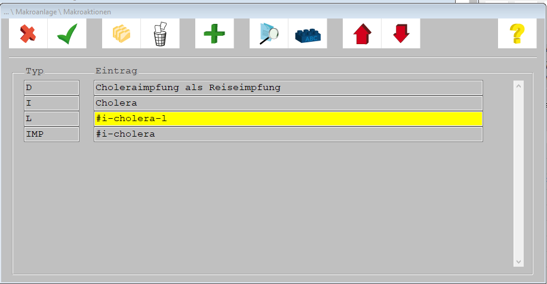

ABOUT
---

CGM M1 Pro hat Funktionen zur Erstellung von sog. `Textbausteinen` und `Makros`, welche wohl die fehlende CGM-eigene Motivation zur Verbesserung der Software kompensieren soll. Nur ist das Teilen dieser Verbesserungen mit anderen Nutzern ausgesprochen schwierig. Zwar existiert eine import und export Funktion für Textbausteine, diese ist jedoch völlig undokumentiert und ich vermute, dass auc niemand bei CGM versteht wie genau es funktioniert. Für Makros gibt es keine solche Funktion.

Ich habe jedoch Makros zur Unterstützung beim Impfen (alle gängigen inkl. Corona Impfungen) erstellt, die ich nun weitergeben möchte. Die Textbausteine kann man importieren, die Makros muss man leider händisch nachbauen, aber der Aufwand kann sich lohnen.

Instructions
---

Die Datei `textbausteine` kann über die Textbausteinsbearbeitungsoberfläche importiert werden. `makros.txt` beschreibt den Aufbau und Inhalt der Makros, welche nach dem Import der Textbausteine händisch erstellt werden müssen.

